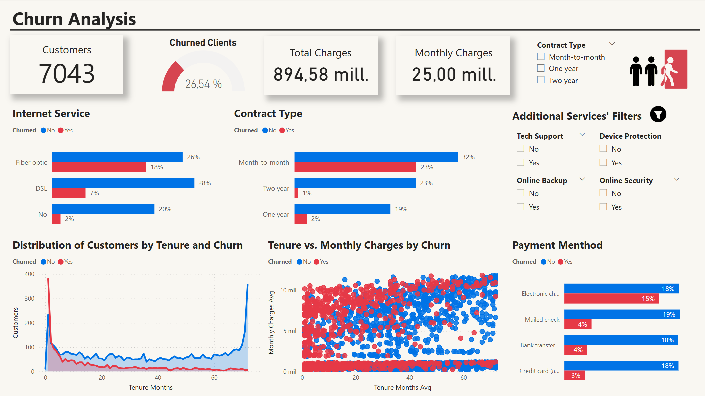
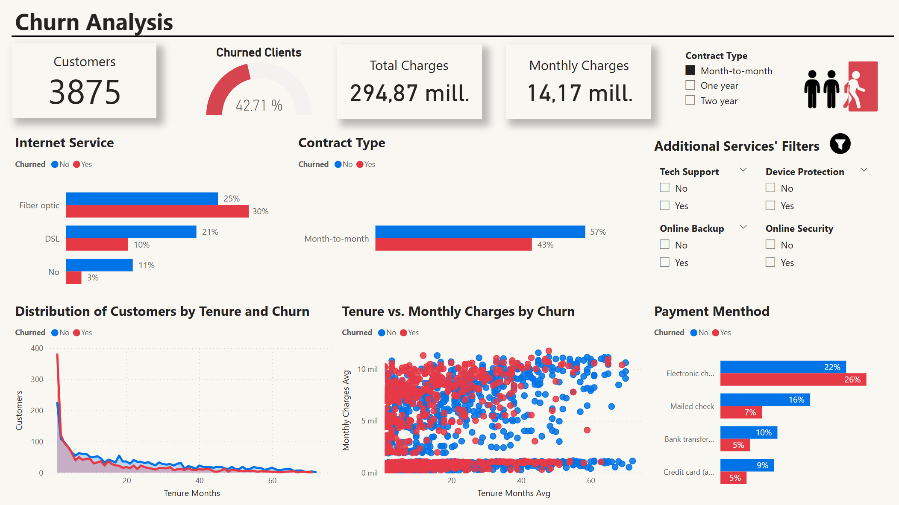
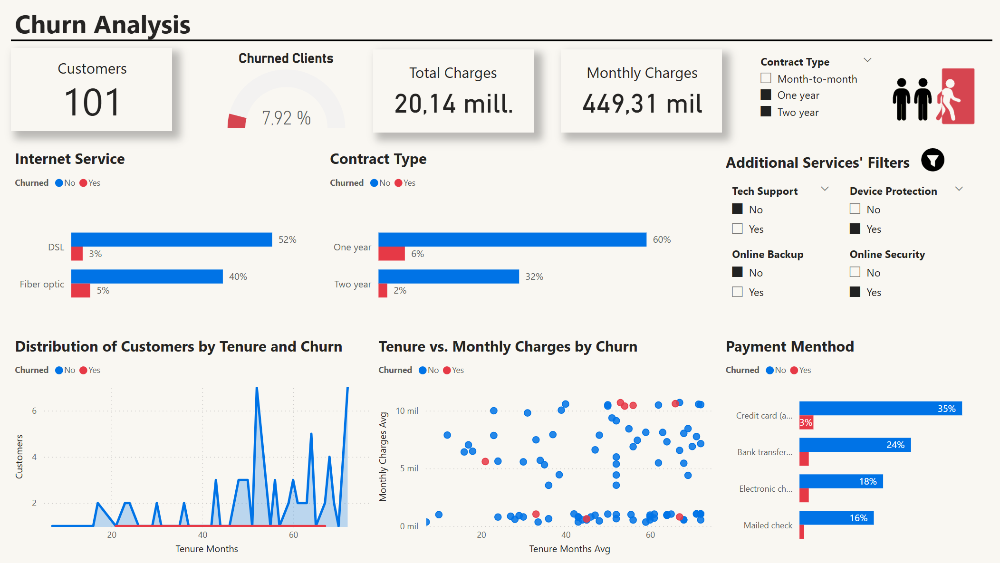

# 📊 Proyecto de Análisis y Predicción de Churn

Este proyecto utiliza Machine Learning (estándar y Spark) para predecir la probabilidad de que un cliente de una empresa de telecomunicaciones abandone el servicio (**Churn**). Se comparan diferentes modelos y se simulan estrategias de retención para evaluar su impacto en el negocio.

---

## 📌 **Estructura del Proyecto**

```
/ChurnRetention-SP
│── /dashboards
│   ├── CustomerChurnAnalysis.pbix
│   ├── /images
│   │   ├── powerbi_combo_filter.png
│   │   ├── powerbi_dashboard.png
│   │   ├── powerbi_month_filter.png
│── /data
│   ├── raw_customerChurn.csv
│   ├── cleaned_customerChurn.csv  # Listo para usarse en Power BI
│   ├── preprocessed_customerChurn.csv  # Listo para entrenar los modelos 
│── /models
│   ├── best_model.joblib  # Mejor modelo estándar
│   ├── best_spark_model.zip # Mejor modelo de Spark MLlib
│── /notebooks
│   ├── Exploratory_Analysis.ipynb  # Limpieza de datos & visualización
│   ├── Preprocessing.ipynb  # Preparación de los datos para entrenar los modelos
│   ├── Model_Training.ipynb  # Entrenamiento de modelos estándar y tuning
│   ├── Spark_Model_Training.ipynb  # Entrenamiento de modelos de la librería Spark MLlib
│   ├── Simulacion.ipynb # Simulación de la reducción de Churn  
│── README.md
```

---

## 📊 **1. Análisis Exploratorio**
El archivo ['Exploratory_Analysis.ipynb'](notebooks/Exploratory_Analysis.ipynb) contiene:  
✅ Carga y limpieza de datos  
✅ Visualización de tendencias de Churn con **Matplotlib & Seaborn**  
✅ Análisis de correlaciones y factores clave   

📌 El dataset que resulta tras el EDA se guarda en: ['/data/cleaned_customerChurn.csv'](/data/cleaned_customerChurn.csv). 

---
## ⚙️ **2. PowerBI Dashboard: Análisis de clientes**
Este proyecto incluye un **dashboard interactivo de PowerBI** que aporta insights acerca de los clientes y los factores que influyen en el Churn.

📌 El dashboard de PowerBI: ['dashboards/CustomerChurnAnalysis.pbix'](dashboards/CustomerChurnAnalysis.pbix)

### 🔎 **¿Qué contiene este dashboard?**
✅ **KPIs Clave de Negocio**: Se muestra información sobre la **base de clientes** (Total clientes y % de Churn Rate) e **indicadores financieros** (Cargos totales y mensuales)  
✅ **Análisis de servicios contratados y Churn:** Permite analizar como impacta el tipo de servicio de Internet, contrato y método de pago sobre el Churn.   
✅ **Análisis temporal y tendencias de Churn**: Se muestra la distribución de los clientes según antigüedad y como esto, junto con los cobros mensuales impactan sobre el Churn.  
✅ **Filtros interactivos**: Se pueden segmentar los datos según el tipo de contrato y los servicios adicionales de los clientes.  

### 📷 **Dashboard Previews**

#### **🔹 Dashboard Overview**  
[](dashboards/images/powerbi_dashboard.png)

#### **🔹 Filtro por tipo de contrato mes a mes**
[](dashboards/images/powerbi_month_filter.png)

#### **🔹 Combinación de filtros por contrato y servicios adicionales**
[](dashboards/images/powerbi_combo_filter.png)

## ⚙️ **3. Preprocesamiento de Datos**
El archivo ['Preprocessing.ipynb'](notebooks/Preprocessing.ipynb) incluye los pasos para preparar los datos antes del modelado:  
✅ Transformación de valores categóricos con **One-Hot Encoding**  
✅ **Normalización y estandarización** de variables  
✅ **Tratamiento de valores nulos y outliers**

📌 El dataset preprocesado se guarda en: ['/data/preprocessed_customerChurn.csv'](/data/preprocessed_customerChurn.csv), listo para su uso en modelos.  

---

## 🤖 **4. Modelado y Evaluación**
El archivo ['Model_Training.ipynb'](notebooks/Model_Training.ipynb) desarrolla:  
✅ **Balanceo de datos** con **SMOTE y RandomUnderSampler**  
✅ Modelos como **Regresión Logística, Decisión Tree, Random Forest, XGBoost y LightGBM**  
✅ Evaluación de los modelos con **SHAP Values, Matriz de confusión, Curva ROC y Curva Precision-Recall**  
✅ **Optimización de hiperparámetros** con **Grid Search**

📌 **El mejor modelo se guarda en:** ['/models/best_model.joblib'](/models/best_model.joblib)

---

## 🎯 **5. Simulación de Reducción de Churn**
 
El archivo ['Simulacion.ipynb'](notebooks/Simulacion.ipynb) calcula el impacto de estrategias de retención:  
✅ **Simulación de estrategias de retención**  
✅ **Cálculo del ahorro financiero**

---

## 🤖 **6. Modelado y Evaluación en Spark**
El archivo ['Spark_Model_Training.ipynb'](notebooks/Spark_Model_Training.ipynb) desarrolla modelos utilizando Spark MLlib, una librería optimizada para procesamiento en Big Data.  
✅ Transformación de datos con **VectorAssembler** para trabajar con Spark.  
✅ Entrenamiento de modelos como **Decision Tree, Random Forest y Gradient-Boosted Trees (GBTClassifier)**.    
✅ **Optimización con CrossValidator y ParamGridBuilder** para mejorar los hiperparámetros.  

📌 **El mejor modelo de Spark se guarda en** ['/models/best_spark_model.zip'](/models/best_spark_model.zip)

---

## 📥 **7. Instalación y Uso**
### **Descargar el Repositorio**
```
bash
git clone https://github.com/angelfergar/ChurnRetention-SP.git
cd ChurnRetention-SP
```

---

## 📈 **8. Resultados Clave**
* **Los principales factores que provocan la baja de los clientes** son:
  * **La calidad de los servicios** (**Fibra óptica, servicio técnico**, seguridad online y protección de dispositivos)
  * **Nuevos clientes con contratos mes a mes**
  * **El método de pago Electronic Check**
    
* **El modelo XGboost con GridSearchCV tuvo el mejor rendimiento con un F1-Score de 0.80.**
* **El modelo GBT Classifier de Spark tuvo el mejor rendimiento con un F1-Score de 0.80.**
* Según el modelo **XGBoost**, con una estrategia que permita una **mejora de retención de clientes del 35%, habría un ahorro de 365,400.00€.**
* Según el modelo **GBT Classifier**, con una estrategia que permita una **mejora de retención de clientes del 35%, habría un ahorro de 433,800.00€.**

📊 _Gráficos y visualizaciones detalladas en los notebooks._

---

## 🤝 **9. Contribución**
¡Sugerencias y mejoras son bienvenidas! 🚀

📌 **Desarrollado por**: Ángel Fernández  
✉️ Contacto: anfernagar@gmail.com
